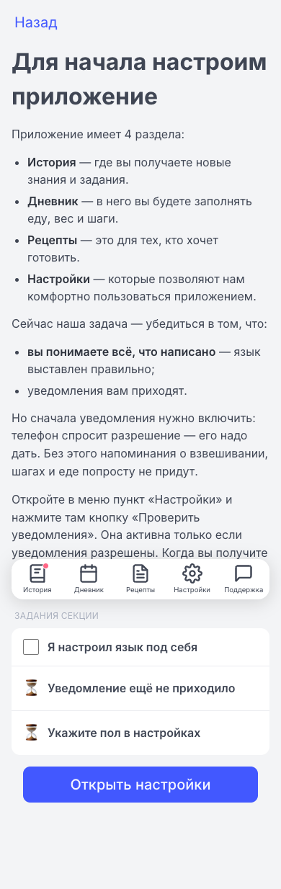
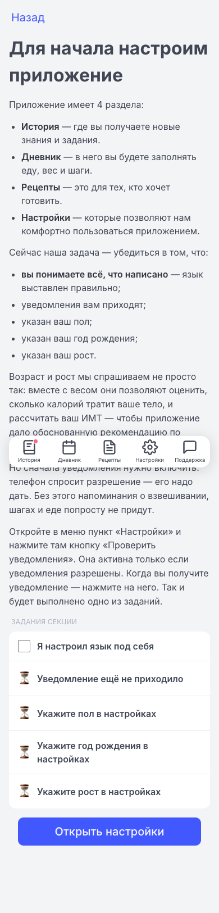

## Баг 2 — в задании «настраиваем приложение» нет галочек рост и год рождения

### Где

- `frontend/story/story.yaml` (секция `setup`)
- `frontend/src/components/story_widgets.rs` (`SetupControls`)
- `frontend/src/pages/settings.rs`
- `frontend/src/services/story.rs`
- `frontend/src/services/i18n.rs`
- `frontend/src/pages/story.rs`

### Воспроизведение (до)

- Steps: открыть `/story/setup` → раздел «Задания секции» показывает только 3 пункта: язык, уведомление, пол. Нет требования указать рост и год рождения, хотя они нужны для расчёта калорий/BMI.
- Also: вводный текст «Сейчас наша задача — убедиться в том, что:» перечислял только язык + уведомления.



### Исправление

- Список задач секции `setup` стал `[sex, age, height, lang, notif]` — теперь секция требует все пять пунктов, включая рост и год рождения.
- Добавлен story-флаг `HEIGHT_SET` + событие `height_set` + задача `height` (по образцу `age`/`birth_year_set`).
- `set_flag(HEIGHT_SET, true)` подключён в `set_height` (`settings.rs`): сохранение валидного роста помечает задачу секции `setup`, как это уже делает `sex`/`birth_year`.
- `SetupControls` рендерит строки возраст + рост со статусом (галочка/песочные часы) и backfill: пользователи, у которых `birth_year` / `height` уже были заданы ДО этой фичи, имеют значение в профиле, но флаг story не срабатывал — теперь реальное значение профиля отражается, чтобы они могли завершить секцию.
- Задача `age` перенесена из секции `accounting` в `setup` (в `accounting` осталось `[weigh_in, first_weigh, weight_streak]`).
- Новый i18n-текст (`story.setup.why_math` + строки `check_sex_line` / `check_age_line` / `check_height_line` + статусы `age_*` / `height_*`), объясняющий, что возраст + рост нужны для математики (расчёт калорий/BMI).

Ключевые ханки диффа (`git diff -- frontend/story/story.yaml frontend/src/components/story_widgets.rs frontend/src/pages/settings.rs frontend/src/services/story.rs`):

```diff
diff --git a/frontend/story/story.yaml b/frontend/story/story.yaml
index 88ab3eb..7310eb7 100644
--- a/frontend/story/story.yaml
+++ b/frontend/story/story.yaml
@@ -32,7 +32,7 @@ sensors: [calorie_planka_set, sub_active, sub_paid,
           snack_yesterday, no_high_cal_drink_yesterday]
 sources: [diary, weight, weighin_q5, steps, steps_planka, veg, protein, no_liquid_cal, evening_protein]
 events:  [weight_saved, steps_saved, food_logged, recipe_finalized, recipe_in_diary,
-          waste_entered, restaurant_logged, photos_done, sex_selected, birth_year_set,
+          waste_entered, restaurant_logged, photos_done, sex_selected, birth_year_set, height_set,
           weigh_in_reminder_on, steps_reminder_on, lang_configured, notif_received,
           food_repeated]
 
@@ -47,6 +47,9 @@ tasks:
   - id: age
     title: {en: "Set your birth year", ru: "Укажите год рождения"}
     close: {event: birth_year_set}
+  - id: height
+    title: {en: "Set your height", ru: "Укажите рост"}
+    close: {event: height_set}
   - id: lang
     title: {en: "Confirm the app language", ru: "Подтвердите язык приложения"}
     close: {event: lang_configured}
@@ -153,13 +156,14 @@ chapters:
       - id: setup
         icon: "⚙️"
         title: {en: "Let's set up the app", ru: "Для начала настроим приложение"}
-        tasks: [sex, lang, notif]
-        # All three gate completion (no override → every listed task must be done).
+        tasks: [sex, age, height, lang, notif]
+        # Every listed task gates completion (no override → all must be done).
         blocks:
           - {text_key: story.setup.intro}
           - {bullets: [story.setup.s_story, story.setup.s_diary, story.setup.s_recipes, story.setup.s_settings]}
           - {text_key: story.setup.task_intro}
-          - {bullets: [story.setup.check_lang_line, story.setup.check_notif_line]}
+          - {bullets: [story.setup.check_lang_line, story.setup.check_notif_line, story.setup.check_sex_line, story.setup.check_age_line, story.setup.check_height_line]}
+          - {text_key: story.setup.why_math}
           - {text_key: story.setup.enable_push}
           - {text_key: story.setup.instructions}
           - {widget: {id: setup_controls}}
@@ -167,7 +171,7 @@ chapters:
       - id: accounting
         icon: "💰"
         title: {en: "The accounting of weight loss", ru: "Бухгалтерия похудения"}
-        tasks: [weigh_in, first_weigh, weight_streak, age]
+        tasks: [weigh_in, first_weigh, weight_streak]
         # Gate the next section ("My first food entries") on BOTH enabling the
         # weigh-in reminder AND recording an actual weight.
         complete: {all: [{task: weigh_in}, {task: first_weigh}]}
```

```diff
diff --git a/frontend/src/components/story_widgets.rs b/frontend/src/components/story_widgets.rs
index 3cbc760..02632c0 100644
--- a/frontend/src/components/story_widgets.rs
+++ b/frontend/src/components/story_widgets.rs
@@ -582,12 +582,25 @@ pub fn SetupControls() -> impl IntoView {
     let lang_done = create_rw_signal(false);
     let notif_done = create_rw_signal(false);
     let sex_done = create_rw_signal(false);
+    let age_done = create_rw_signal(false);
+    let height_done = create_rw_signal(false);
     create_effect(move |_| {
         story_ver.get();
         spawn_local(async move {
             lang_done.set(story::get_flag(story::LANGUAGE_CONFIGURED).await);
             notif_done.set(story::get_flag(story::NOTIFICATION_RECEIVED).await);
             sex_done.set(story::get_flag(story::SEX_SELECTED).await);
+            // Backfill: users who set birth_year / height BEFORE this feature have
+            // the profile value but never fired the story flag. Reflect the real
+            // profile value so they can complete the section.
+            if !story::get_flag(story::BIRTH_YEAR_SET).await && profile::get_birth_year().is_some() {
+                story::set_flag(story::BIRTH_YEAR_SET, true).await;
+            }
+            if !story::get_flag(story::HEIGHT_SET).await && profile::get_height_cm().is_some() {
+                story::set_flag(story::HEIGHT_SET, true).await;
+            }
+            age_done.set(story::get_flag(story::BIRTH_YEAR_SET).await);
+            height_done.set(story::get_flag(story::HEIGHT_SET).await);
         });
     });
@@ -635,8 +648,22 @@ pub fn SetupControls() -> impl IntoView {
                         {move || if sex_done.get() { t("story.setup.sex_status_done") } else { t("story.setup.sex_status_pending") }}
                     </span>
                 </div>
+                <div style="border-bottom: 0.5px solid var(--bulma-border-weak);"></div>
+                <div style="display: flex; align-items: center; gap: 12px; padding: 14px 16px;">
+                    <span style="font-size: 22px; width: 22px; text-align: center;">{move || if age_done.get() { "\u{2705}" } else { "\u{23f3}" }}</span>
+                    <span class="is-size-6 has-text-weight-semibold" style="flex: 1;">
+                        {move || if age_done.get() { t("story.setup.age_status_done") } else { t("story.setup.age_status_pending") }}
+                    </span>
+                </div>
+                <div style="border-bottom: 0.5px solid var(--bulma-border-weak);"></div>
+                <div style="display: flex; align-items: center; gap: 12px; padding: 14px 16px;">
+                    <span style="font-size: 22px; width: 22px; text-align: center;">{move || if height_done.get() { "\u{2705}" } else { "\u{23f3}" }}</span>
+                    <span class="is-size-6 has-text-weight-semibold" style="flex: 1;">
+                        {move || if height_done.get() { t("story.setup.height_status_done") } else { t("story.setup.height_status_pending") }}
+                    </span>
+                </div>
             </div>
-            {move || (lang_done.get() && notif_done.get()).then(|| view! {
+            {move || (lang_done.get() && notif_done.get() && sex_done.get() && age_done.get() && height_done.get()).then(|| view! {
                 <p class="is-size-6 has-text-weight-semibold has-text-success" style="margin-top: 16px;">
                     {move || t("story.setup.next_unlocked")}
                 </p>
```

```diff
diff --git a/frontend/src/pages/settings.rs b/frontend/src/pages/settings.rs
index b3b380e..a8c0beb 100644
--- a/frontend/src/pages/settings.rs
+++ b/frontend/src/pages/settings.rs
@@ -49,15 +49,19 @@ pub fn SettingsPage() -> impl IntoView {
     };
 
     // Height (cm, localStorage) + the latest logged weight → BMI. Lets us read how
-    // much of the body mass is fat.
+    // much of the body mass is fat. Saving a valid height also marks the
+    // setup-section `height` story task (like sex/birth_year).
     let height = create_rw_signal(profile::get_height_cm());
     let set_height = move |raw: String| {
         let cm = raw.trim().replace(',', ".").parse::<f64>().ok().filter(|h| *h > 0.0);
         profile::set_height_cm(cm.unwrap_or(0.0));
         height.set(cm);
+        if cm.is_some() {
+            spawn_local(async { story::set_flag(story::HEIGHT_SET, true).await; });
+        }
     };
```

```diff
diff --git a/frontend/src/services/story.rs b/frontend/src/services/story.rs
index 0187e83..84824d7 100644
--- a/frontend/src/services/story.rs
+++ b/frontend/src/services/story.rs
@@ -48,6 +48,9 @@ pub const SEX_SELECTED: &str = "sex_selected";
 /// Set once the user saves a valid year of birth in settings (accounting section
 /// task `age`). A STORY flag — distinct from the synced profile.birth_year value.
 pub const BIRTH_YEAR_SET: &str = "birth_year_set";
+/// Set once the user saves a valid height in settings (setup section task
+/// `height`). A STORY flag — distinct from the synced profile.height_cm value.
+pub const HEIGHT_SET: &str = "height_set";
@@ -119,6 +122,7 @@ pub async fn engine_snapshot() -> crate::services::story_dsl::EngineSnapshot {
         ("photos", PROGRESS_PHOTOS_TAKEN),
         ("sex", SEX_SELECTED),
         ("age", BIRTH_YEAR_SET),
+        ("height", HEIGHT_SET),
         ("lang", LANGUAGE_CONFIGURED),
         ("notif", NOTIFICATION_RECEIVED),
         ("weigh_in", WEIGH_IN_REMINDER),
```

### Результат (после)

- То же действие (открыть `/story/setup`) теперь показывает 5 обязательных задач, включая «Укажите рост» и «Укажите год рождения»; секция завершается только когда выполнены все; текст объясняет, зачем нужны возраст + рост.



### Проверка

- Build/tests: Both tasks passed.

  1. Frontend build: SUCCESS. `trunk build` finished with `✅ success`. Only pre-existing dead_code warnings (16 total, none from bug 2 edits); PostBuild hook ran cleanly and emitted build version `29560c12461d`.

  2. Story engine tests: SUCCESS. `cargo test --lib story` ran 1 test — passed.
