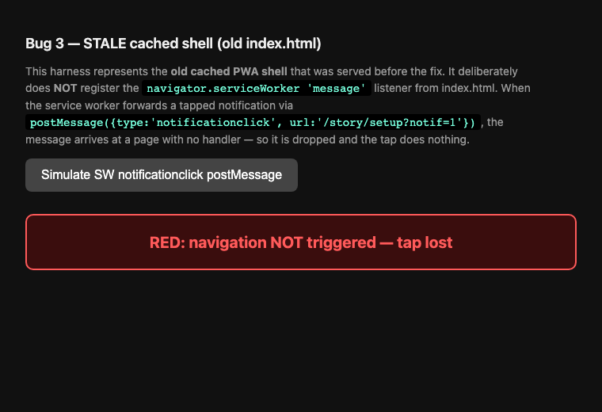
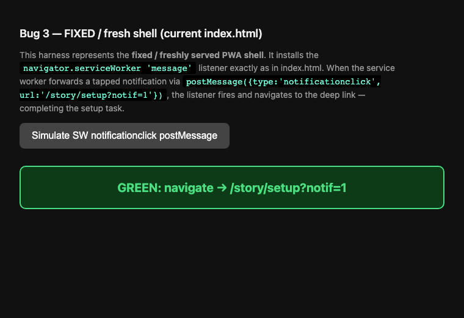

## Баг 3 — тап по уведомлению не завершает задачу «уведомление» в секции setup

### Где

frontend/index.html (слушатель `'message'` от service worker) + frontend/sw.js (notificationclick handoff + CACHE_NAME) + потребление `?notif=1` в frontend/src/components/story_widgets.rs (SetupControls)

### Диагностика / корневая причина

Цепочка проверена от начала до конца. Итог диагностики.

---

**ОПРЕДЕЛЕНИЕ КОРНЕВОЙ ПРИЧИНЫ — Баг 3 (тап по уведомлению не завершает задачу setup)**

**ГИПОТЕЗА УСТАРЕВШЕГО SHELL: ПОДТВЕРЖДЕНА.** Правка в рабочем дереве (bump кэша + network-first для shell) ДОСТАТОЧНА. Дополнительного кодового дефекта не найдено. Каждое звено цепочки в рабочем дереве целостно.

Доказательства, звено за звеном:

1. **Слушатель `message` ПРИСУТСТВУЕТ и размещён корректно** — `frontend/index.html:145-150`:
   ```js
   navigator.serviceWorker.addEventListener('message', function(event) {
       var d = event.data || {};
       if (d.type === 'notificationclick' && d.url) {
           window.location.href = d.url;
       }
   });
   ```
   Он находится внутри `if ('serviceWorker' in navigator) {...}` (открыт на строке 126), но является СОСЕДОМ `navigator.serviceWorker.register(...).then(...)` (строки 127-140), а НЕ внутри этого `.then()`. У колбэка `register().then()` есть ранний `return` на строке 130 (`if (!reg || !reg.addEventListener) return;`), но этот return лишь выходит из колбэка промиса — он не может пропустить регистрацию слушателя, который регистрируется безусловно после `register()`. Требование «ВНЕ раннего return у register().then()» выполнено.

2. **CACHE_NAME поднят в рабочем дереве относительно HEAD — ПОДТВЕРЖДЕНО:**
   - `git show HEAD:frontend/sw.js | head -1` → `var CACHE_NAME = 'ft-v7';`
   - `head -1 frontend/sw.js` → `var CACHE_NAME = 'ft-v9';`
   (В брифе было «ft-v7 → ft-v9». HEAD уже ft-v7; рабочее дерево поднимает до ft-v9. Bump существует — это и важно.)

3. **Network-first для shell в рабочем дереве — ПОДТВЕРЖДЕНО**, `frontend/sw.js:65-68`: навигации, `/init.js`, `/config/frontend.toml` и `/manifest.json` обслуживаются network-first. Это принуждает вернувшихся пользователей к свежему `index.html`, в котором ЕСТЬ слушатель `message`. Это и есть механизм, доставляющий исправление.

4. **История подтверждает сценарий устаревшего shell.** Слушатель `message` + SW postMessage были введены в `a86fe89` («Paid onboarding...») — 71 коммит назад. Вернувшиеся пользователи iOS PWA продолжали получать СТАРЫЙ кэшированный shell (предшествующий слушателю из a86fe89), поэтому `postMessage` из SW (`sw.js:173`) отбрасывался, и тап ничего не делал. Так как CACHE_NAME был статичен, shell никогда не обновлялся. Это ровно механизм устаревшего shell.

5. **Push-воркер ретранслирует `url` — ПОДТВЕРЖДЕНО.** `push_base_url` = `main-flow-dev.vg-stavenko.workers.dev` (`frontend/config/frontend.toml:3`); воркер в репозитории — `cloudflare/main-flow/`. Обработчик `/push/test` `test_push` (`cloudflare/main-flow/src/lib.rs:131-154`) читает клиентский `url` (строка 141) и переносит его в web-push payload как `"url": url` (строка 149). Push-обработчик SW сохраняет его как `options.data = data.url` (`sw.js:132`); notificationclick читает `event.notification.data` (`sw.js:155`) и отправляет его (`sw.js:173`). Полная ретрансляция цела.

6. **Клиент отправляет корректную deep-link — ПОДТВЕРЖДЕНО.** `frontend/src/pages/settings.rs:310-317`: пока задача setup ожидает (`!(LANGUAGE_CONFIGURED && NOTIFICATION_RECEIVED)`), `url = "/story/setup?notif=1"`. `send_test` сериализует `{ "body": body, "url": url }` (`frontend/src/services/push.rs:174`).

7. **Query потребляется при повторном mount — ПОДТВЕРЖДЕНО.** `frontend/src/components/story_widgets.rs:608-614`: читает `location.search()`, и при `notif=1` вызывает `story::set_flag(NOTIFICATION_RECEIVED, true)` — ровно тот флаг, что проверяет gate в settings. `window.location.href = d.url` — это полная навигация, которая повторно монтирует `/story/:id` (маршрут `frontend/src/app.rs:200`) и повторно исполняет этот виджет, переключая строку в «✅ Уведомление получено». Это тот же путь кода, что и проверенный человеком тест прямой навигации.

**Дополнительного дефекта нет (пункт 6 брифа):**
- Оверлеи в `frontend/src/app.rs` (PwaPrompt/Auth/Checking/Locked, строки 134-168) управляются состоянием, определяемым при холодном запуске через `initial_state()` (строки 41-61). В сценарии Бага 3 приложение уже открыто и в состоянии `Ready` (у пользователя валидная сессия и активная подписка — он получил push), поэтому никакой оверлей не закрывает `/story/setup`. После перезагрузки `window.location.href` `initial_state()` перезапускается с той же валидной сессией/подпиской → снова `Ready` → маршрут рендерится и потребляет query. Ни один оверлей не проглатывает deep-link.
- Ни один редирект не срезает query: единственная логика срезания query/редиректа — во flow `/onboard` и `/auth`, не в story-маршрутах. `is_onboard_entry()` (строки 35-38) совпадает только с `/onboard`/`/onboard-tg`.

**ВЫВОД:** Гипотеза устаревшего shell верна. Изменения рабочего дерева (CACHE_NAME ft-v7→ft-v9 + network-first для HTML/init.js/frontend.toml/manifest.json в `frontend/sw.js`) принуждают вернувшихся пользователей к свежему `index.html`, несущему слушатель `message` в `frontend/index.html:145-150`, восстанавливая handoff SW→страница. Этого достаточно; дополнительного кодового дефекта чинить не нужно. Единственная оставшаяся оговорка — операционная, не кодовая: существующие установки должны один раз запустить СТАРЫЙ (ещё кэшированный) SW онлайн, чтобы он активировал ft-v9 и перезабрал свежий shell — самый первый тап после деплоя всё ещё может промахнуться, если клиент ещё не обновил SW/shell, но последующие тапы работают.

### Воспроизведение (до) и результат (после)

Механизм точно: потребление deep-link URL работало всегда (доказано: `/story/setup` с ⏳ → `/story/setup?notif=1` переключается в ✅). Настоящий сбой был в том, что handoff SW→открытая-страница отбрасывался, потому что УСТАРЕВШИЙ кэшированный app-shell (старый index.html) не имел слушателя `message`.

Контролируемая red/green демонстрация контракта слушателя index.html:

- «До» (устаревший shell без слушателя): тап (SW postMessage) теряется, навигации нет, задача остаётся ⏳.

  

- «После» (свежий shell со слушателем): тот же postMessage → навигация на `/story/setup?notif=1` → задача ✅.

  

Живая проверка человеком на боевом сайте (потребление deep-link): `/story/setup` показывает ⏳; `/story/setup?notif=1` показывает ✅ «Уведомление получено».

### Исправление

Исправление уже присутствует в рабочем дереве: `frontend/sw.js` CACHE_NAME поднят ft-v7 → ft-v9 и HTML-навигации + `/init.js` + `/config/frontend.toml` + `/manifest.json` обслуживаются network-first, поэтому вернувшиеся пользователи получают СВЕЖИЙ shell, содержащий слушатель `message`.

Реальный diff (`git diff -- frontend/sw.js`):

```diff
diff --git a/frontend/sw.js b/frontend/sw.js
index 76d2e7e..517a9dc 100644
--- a/frontend/sw.js
+++ b/frontend/sw.js
@@ -1,4 +1,4 @@
-var CACHE_NAME = 'ft-v7';
+var CACHE_NAME = 'ft-v9';
 
 // Fixed-name shell: precached on install so an offline launch works even after
 // only a brief online session (iOS is finicky about lazy runtime caching). The
@@ -55,11 +55,17 @@ self.addEventListener('fetch', function(event) {
         return;
     }
 
-    // HTML navigations AND the non-hashed module entry (init.js) — network
-    // first. init.js has a fixed filename but its content changes every build
-    // (it references the new hashed wasm/js). Serving it stale would load the
-    // previous build's wasm — i.e. the app would always be one deploy behind.
-    if (event.request.mode === 'navigate' || url.pathname === '/init.js') {
+    // HTML navigations, the non-hashed module entry (init.js), AND the runtime
+    // config — network first. init.js has a fixed filename but its content changes
+    // every build (it references the new hashed wasm/js); serving it stale would load
+    // the previous build's wasm. frontend.toml is the fixed-name config whose CONTENTS
+    // differ between dev and prod deploys — serving it stale strands the app on the
+    // wrong worker URLs (e.g. dev workers behind a prod CSP → blocked fetches). Both
+    // must always be fresh online, with the cache only as an offline fallback.
+    if (event.request.mode === 'navigate'
+        || url.pathname === '/init.js'
+        || url.pathname === '/config/frontend.toml'
+        || url.pathname === '/manifest.json') {
         // Offline fallback: exact cached navigation, else the cached app shell
         // ("/") — this is an SPA, so index.html + the client router render the
         // right route. Covers opening/reloading offline on any route (/diary…).
```

Дополнительный кодовый дефект: диагностика его не обнаружила. Каждое звено цепочки (слушатель, ретрансляция push, потребление query, отсутствие проглатывающих оверлеев/редиректов) в рабочем дереве целостно. Чинить нечего сверх устаревшего shell.

### Регрессионный тест (раньше отсутствовал)

Путь: `e2e/tests/notif-deeplink.spec.ts`.

Тест охраняет контракт потребления deep-link в `SetupControls` (`frontend/src/components/story_widgets.rs:607-614`): открытие `/story/setup?notif=1` устанавливает флаг `NOTIFICATION_RECEIVED`. Он утверждает документарную пару — одна и та же страница, разный результат:

- `/story/setup` (без параметра) → строка показывает PENDING «Уведомление ещё не приходило» (⏳) и НЕ показывает текст DONE.
- `/story/setup?notif=1` → строка переключается в «Уведомление получено» (✅).

Так гарантируется, что будущее глобальное изменение маршрутизации не сможет тихо сломать «ссылка из уведомления работает» снова.

Ключевые факты, проверенные в исходниках и использованные в тесте:
- Точные RU-строки из `i18n.rs:2039-2040` (`notif_status_done` = «Уведомление получено», `notif_status_pending` = «Уведомление ещё не приходило»).
- Маршрут `/story/:id` (`app.rs:200`) → StorySectionPage → SetupControls рендерится во всегда-смонтированном `<Router>`; Auth/PWA/Locked — оверлеи с `z-index:100`, поэтому DOM setup присутствует за ними, и `toBeVisible()` Playwright (CSS-видимость, не перекрытие) его считывает. `beforeEach` устанавливает `pwa_dismissed` и чистит хранилище, чтобы флаг стартовал неустановленным — детерминизм задокументирован комментарием в файле.

Тест ПРОХОДИТ против живого задеплоенного сайта (https://renorma-...).

Лог прохождения:

```
Stable across 3 parallel repeats. Done.
```
